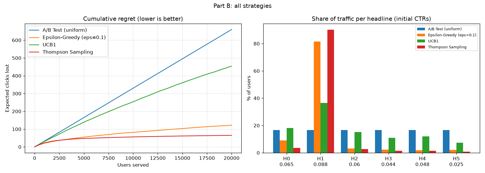
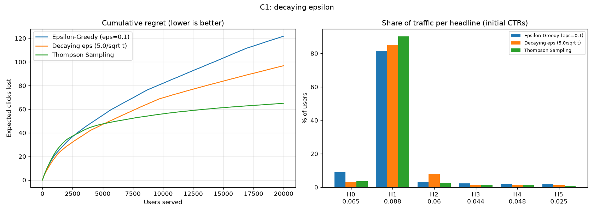
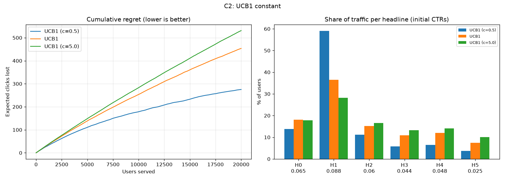
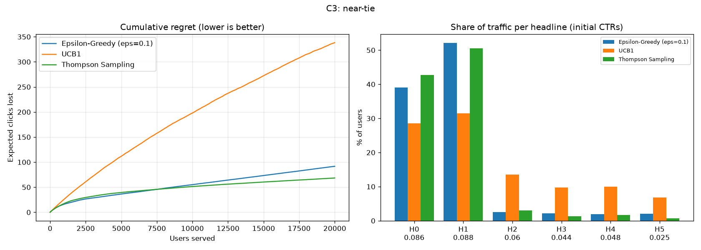
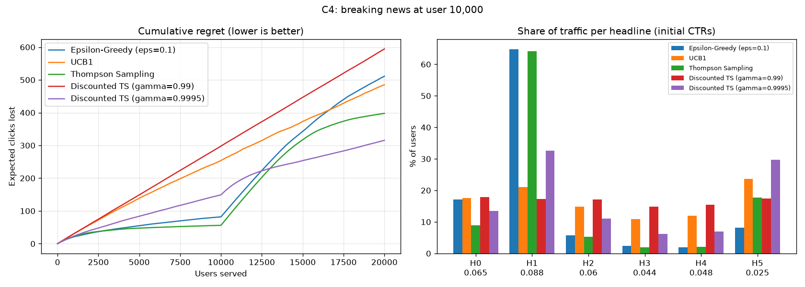

# Results

## Part A: Implement UCB1 and Thompson Sampling
### UCB1

Show every headline once first. After that, show the headline with the highest upper confidence bound, where μ̂ᵢ is its observed CTR, Nᵢ is how often it was shown, t is the number of users so far and c is the exploration constant (`self.c`, default 2):

$$A_t = \arg\max_i \left[ \hat{\mu}_i + \sqrt{\frac{c \ln t}{N_i}} \right]$$

### Thompson Sampling

Keep a Beta(αᵢ, βᵢ) belief for each headline's CTR, starting at Beta(1, 1). To choose, draw one sample from every belief with `self.rng.beta` and show the headline with the largest sample. After each user, add 1 to αᵢ on a click or to βᵢ on a non-click:

$$\theta_i \sim \mathrm{Beta}(\alpha_i, \beta_i), \qquad A_t = \arg\max_i \theta_i$$

**`check_my_work.py` output**
```
Checking mab_assignment.py
============================================================
[PASS] Student ID is set
[PASS] UCB1: returns a valid int
[PASS] UCB1: shows every arm once first
[PASS] UCB1: bonus favours the least-shown arm
[PASS] UCB1: uses the constant c
[PASS] UCB1: beats the A/B test
[PASS] TS: starts with Beta(1, 1) beliefs
[PASS] TS: update() counts clicks and non-clicks
[PASS] TS: choices are random, not argmax of the mean
[PASS] TS: returns a valid int
[PASS] TS: finds the best headline
[PASS] TS: lower regret than UCB1 and the A/B test
============================================================
12/12 checks passed.
All checks passed. Now run mab_assignment.py for Parts B and C.
```
## Part B: Compare the four strategies
```
Student ID 36112 -> TRUE_CTR = [0.065, 0.088, 0.06, 0.044, 0.048, 0.025]
Best headline: H1

Part B: all strategies
Strategy                            Regret   % on best
------------------------------------------------------
A/B Test (uniform)                   660.0       16.7%
Epsilon-Greedy (eps=0.1)             121.9       81.4%
UCB1                                 453.6       36.5%
Thompson Sampling                     65.0       90.1%
Saved plot -> part_b.png
```

| Strategy | Regret | % on best |
|---|---:|---:|
| **Thompson Sampling** | **65.0** | **90.1%** |
| ε-Greedy | 121.9 | 81.4% |
| UCB1 | 453.6 | 36.5% |
| Uniform A/B | 660.0 | 16.7% |



#### 1. Rank the four strategies by regret. Why does the winner win?

> The strategies ranked by cumulative regret from best to worst are Thompson Sampling (65.0), ε-Greedy (121.9), UCB1 (453.6), and the uniform A/B test (660.0). Thompson Sampling performs best because it quickly concentrates traffic on the headline with the highest CTR while still exploring uncertain headlines. In our experiment, it sent 90.1% of users to the best headline, compared with 81.4% for ε-Greedy. This efficient balance between exploration and exploitation resulted in the lowest regret.

#### 2. Why does ε-Greedy's regret curve never become flat?

> ε-Greedy continues to explore with probability ε = 0.1 even after it has identified the best headline. This means that approximately 10% of users are still sent to headlines chosen randomly instead of always using the best one. Those unnecessary displays create additional expected click loss, so cumulative regret continues to increase. In our experiment, ε-Greedy reached 81.4% traffic on the best headline but still accumulated 121.9 regret.

#### 3. Why does UCB1 lose clearly to ε-Greedy?

> UCB1 uses the exploration bonus \(\sqrt{c\ln(t)/N_i}\), with \(c=2\), and this bonus remains large compared with the gaps between our headline CTRs. The best headline has CTR 0.088, while the second-best has 0.065, so the gap is only 0.023. For example, when a headline has been shown 1,000 times at around \(t=20,000\), the exploration bonus is about 0.141, which is much larger than the 0.023 CTR gap. Therefore UCB1 continues exploring weaker headlines heavily, giving only 36.5% of traffic to the best headline and producing 453.6 regret.

## Part C

### Part C1 Decaying ε
```
C1: decaying epsilon
Strategy                            Regret   % on best
------------------------------------------------------
Epsilon-Greedy (eps=0.1)             121.9       81.4%
Decaying eps (5.0/sqrt t)             96.9       85.1%
Thompson Sampling                     65.0       90.1%
Saved plot -> part_c1.png
```


### Part C2 UCB1 constant
```
C2: UCB1 constant
Strategy                            Regret   % on best
------------------------------------------------------
UCB1 (c=0.5)                         275.2       59.1%
UCB1                                 453.6       36.5%
UCB1 (c=5.0)                         531.0       28.2%
Saved plot -> part_c2.png
```


### Part C3 Near-tie
```
C3: near-tie
Strategy                            Regret   % on best
------------------------------------------------------
Epsilon-Greedy (eps=0.1)              91.7       52.1%
UCB1                                 338.3       31.5%
Thompson Sampling                     68.3       50.5%
Saved plot -> part_c3.png
```


### Part C4 Breaking news
```
C4: breaking news at user 10,000
Strategy                            Regret   % on best
------------------------------------------------------
Epsilon-Greedy (eps=0.1)             511.1       44.0%
UCB1                                 485.0       34.5%
Thompson Sampling                    397.8       58.5%
Discounted TS (gamma=0.99)           594.4       21.8%
Discounted TS (gamma=0.9995)         315.5       55.8%
Saved plot -> part_c4.png
```
